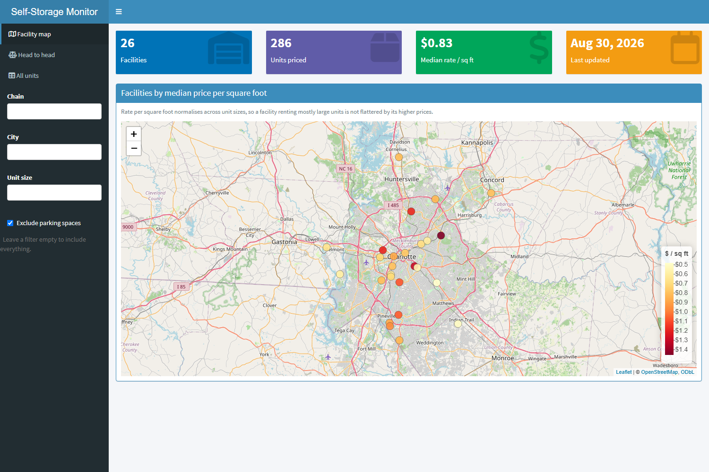

# Self-Storage Price Monitor

An automated daily scraper that pulls self-storage data from Public Storage and CubeSmart, while an interactive R Shiny dashboard visualizes, maps, and compares the different facilities.


**[Live dashboard →](https://omar-fitian.shinyapps.io/self-storage-monitor-dashboard/)**



---

## Usage

Install dependencies for dashboard:

```bash
Rscript install.R
```

Run dashboard locally:

```bash
Rscript -e "shiny::runApp('dashboard')"
```

Install dependencies for scraper:

```bash
pip install -r requirements.txt
```

Run scraper:

```bash
python -m scraper
```


## Scraping stance

Only chains that serve their pages to a plain HTTP request, on paths their
`robots.txt` permits, are included.

## Future improvements
- Market selection
- Pricing forecast
- Spatial data analysis
- Price alerts
